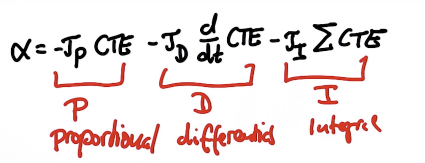
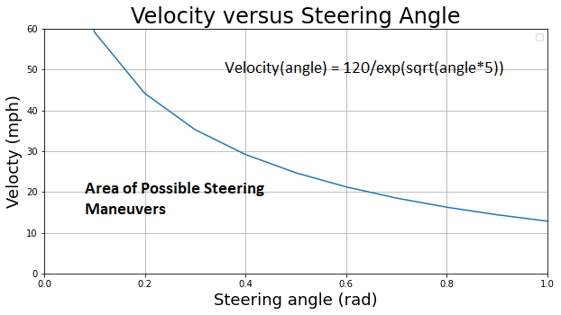

# CarND-Controls-PID
Self-Driving Car Engineer Nanodegree Program

---

In this project, a PID controller in C++ has been implemented to maneuver the vehicle around the lake race track that was used for the Behavioral Cloning Project.

#### Inputs:
The simulator sends the following to the PID controller.
* Cross Track Error (CTE)
* Velocity (mph)
* Current steering angle (radian)

#### Outputs:
A PID Controller computes the appropriate steering angle based on above inputs and feed it to the simulation.

* Steering angle (radian)

---
## Dependencies & running code

For the detailed running instructions, please look at [instructions here](./INSTALLATION.md). 

---
## PID Controller

PID stands for Proportional Integral Derivative. Combintaion of these three components are used to produce a control signal. 

* __P (Proportional)__ is the component that is proportional to the current track error (CTE). 
P controller's drawback is that it has naturally the overshooting problem due to the big absolute value of CTE.
* __D (Differential)__ is the component that uses a rate of change of error to reduce the overshoot caused by the Proportional component. 
* __I (Integral)__ is an integral or sum of previous errors to deal with systematic bias which could drive the system out of the control eventually, but not immediately. 
The systematic bias problem could not be solved by PD controller. That is why I component is introduced.

PID controller is expressed by below equation.

## Hyperparameter optimization

In this project, a combination of [Twiddle algorithm](https://www.youtube.com/watch?v=2uQ2BSzDvXs) and manual tunning technique were utilized to determine the parameters. 
First, **_Kp_** and **_Kd_** parameters were found using Twiddle algorithm on a Robot model with zero steering drift and then **_Ki_** value was tunned manually until a result gets better. The following is the final parameters:
* **_Kp_** : 0.090609
* **_Kd_** : 2.70091
* **_Ki_** : 0.00101

## Throttle adjustment 

From a [research paper](https://www.researchgate.net/publication/275889217_A_Mathematical_Model_for_Driver_and_Pedestrian_Interaction_in_Shared_Space_Environments) by Bani Anvari, I got an idea to define a relation between Steering Angle and Moving Velocity. 
Basically, vehicles have restricted lateral movement. These limitations can be defined by an equation `f(x)=120/exp(sqrt(x*5))` which I defined manually, and we could adjust the velocity of car based on the limitation expressed by this equation during a run-time. 

From above figure it can be concluded that a velocity would be decreased when it reaches beyond blue line. Current steering angle and speed from the simulator is fed to the equation in order to define the maximum speed for the given steering angle. 
If the current speed is higher than the maximum speed, throttle is reduced.

## Conclusion
Generally, PID controller works well for steering angle. However, it was really hard to tunning parameters against increment of velocity.
When velocity increases over time, the overshooting problem occurs and a car gets more swing. To limit unstability of the car, the throttle is configured at 0.3.